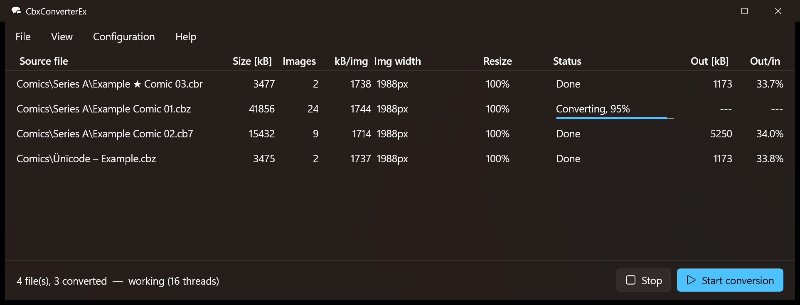

# CbxConverterEx - converter for cbr/cbz and pdf files

This is vibe-code modified version of [CbxConverter](https://tomeko.net/software/CbxConverter) by Tomasz Ostrowski
(GPL v2): ported to Visual Studio / WinUI 3, images are converted in-process using all CPU cores.

CbxConverterEx is maintained by Fabian Korak ([@fkorak](https://github.com/fkorak)).

tl;dr I vibe-coded my way out of some performance problems when converting large archives, and it sort spiraled from there.

> **AI-assisted code:** the port and the changes in this repository were written with
> [Claude Code](https://claude.com/claude-code), Anthropic's AI coding assistant, directed by Fabian Korak.
> See [AI assistance](#ai-assistance) below.



Original program: https://tomeko.net/software/CbxConverter

Converts comic book archives (cbr, cbz, cb7, cbt) and pdf files to cbz with WebP / JPEG / PNG
images, optionally resizing them.

## Building

Requirements:

- Visual Studio 2026 (or 2022 17.10+) with the **Desktop development with C++** workload,
  including the components *vcpkg package manager* and *Windows 11 SDK*.
  The *WinUI application development* workload is recommended (XAML tooling) but not required.

Open `CbxConverterEx.sln` and build. Everything else is fetched automatically:

| What | How | Updating |
|---|---|---|
| Windows App SDK (WinUI 3), C++/WinRT, WIL | NuGet, `src/App/packages.config` | NuGet package manager in VS |
| libwebp, libjpeg-turbo, libpng, libarchive, stb | vcpkg manifest, `vcpkg.json` | change `builtin-baseline` in `vcpkg.json` to a newer vcpkg commit |

Command line:

```
msbuild CbxConverterEx.sln -t:restore -p:RestorePackagesConfig=true
msbuild CbxConverterEx.sln -p:Configuration=Release -p:Platform=x64
```

The first build compiles the vcpkg dependencies (several minutes). Output: `bin\x64\Release\`.

### Deployment

The app is unpackaged: copy the output folder (without `*.pdb`, `*.lib`, `*.exp`, `*.winmd`, about 5 MB).
It uses the shared **Windows App Runtime** (WinUI 3). If it is missing or too old, CbxConverterEx offers on start
to download and install it (official Microsoft installer, silent, once per computer) - see `src/App/RuntimeBootstrap.cpp`.

To bundle the runtime instead (no installation, ~150 MB), build with `-p:CbxSelfContained=true`.

### Optional external tools

- **7-Zip** - only used as a fallback if libarchive cannot unpack an archive (e.g. encrypted RAR).
  Detected automatically (installation or `7z.exe` next to `CbxConverterEx.exe`).
- **Ghostscript** - required for pdf import, configured in Settings.

## Source layout

- `src/Core` - UI independent static library: settings (`CbxConverterEx.ini`; an existing `CbxConverter.ini` in the same directory is imported on first start),
  conversion engine and thread pool, image codecs, archive handling
- `src/App` - WinUI 3 user interface
- `vcpkg-triplets` - static libraries + fix enabling libwebp SIMD code with MSVC (see `libwebp-simd.cmake`)

## Performance notes

Conversion speed is dominated by the WebP encoder (libwebp). Measured on a Ryzen 7 5800X,
24 pages 1988x3056 JPEG -> WebP quality 75, method 4:

| | ms/page |
|---|---|
| 0.16, single archive (one `magick.exe` per page, sequential) | ~730 |
| 0.16, 16 archives in parallel | ~87 |
| 0.20, 16 threads (also for a single archive) | ~58 |
| 0.20, 16 threads, WebP effort 2 (~3% larger files) | ~28 |

Lowering *WebP compression effort* in Settings is the most effective further speedup.

## AI assistance

This repository is transparently flagged as AI-assisted. Starting from the original C++Builder sources
by Tomasz Ostrowski, the following was written with Claude Code (Anthropic) under the direction of
Fabian Korak:

- the port to Visual Studio, C++20 and WinUI 3 (all code under `src/`)
- the in-process conversion engine (libwebp, libjpeg-turbo, libpng, libarchive via vcpkg), replacing ImageMagick / 7-Zip
- the build setup (solution, vcpkg triplets incl. the libwebp SIMD fix, Windows App Runtime bootstrap)
- this README and the changelog entries for version 0.20

The program's behaviour was checked with builds, benchmarks and test conversions (including
Unicode file names and RAR4/RAR5 archives), but the code has not been independently reviewed
line by line. Please report problems via the issue tracker.

## License

GPL v2, as the original CbxConverter.
